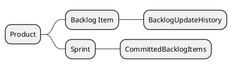
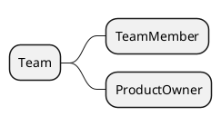
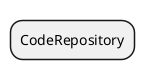

# 图灵敏捷项目管理平台

## Todo

`用户` 可以创建 `产品`，创建产品后，用户成为 `产品拥有者`(下文以 PO 简称），拥有对产品的所有操作权限。

PO 可以组建一支团队，将其他 `在校人员` 加入团队。当在校人员使用该系统后成为系统的 `用户`。用户加入团队后成为 `团队成员`。团队成员具有以下角色：

- 访问者：可以查看数据，无其他权限
- 产品经理：可以创建待办事项、提交待办事项到冲刺中
- 开发者：可以绑定代码仓库，创建待办事项

### 敏捷项目管理核心域

### 代码仓库子域

